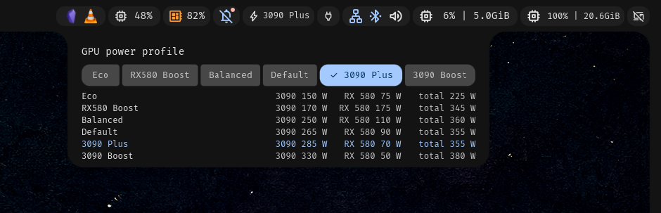

# dms-lact-profiles-widget

DankMaterialShell bar widget to switch [LACT](https://github.com/ilya-zlobintsev/LACT) GPU profiles.
The bar pill shows the active profile; the popout is a button group (same control as the DMS
power-profile selector) with Default plus every profile in `/etc/lact/config.yaml`. Below it, each
profile's power limit per GPU and their total, read straight from the config.



> [!WARNING]
> **This is my personal setup, published as is. Adjust it to yours before installing.**
> It does not use LACT the normal way: `lact-apply` **stops and masks `lactd`** and runs the LACT
> daemon only for a few seconds to apply a profile. That suits a machine where another tool
> (CoolerControl here) owns the fans and LACT should only set power caps and clocks. If you rely
> on `lactd` running (LACT fan curves, automatic profile switching, the LACT GUI at any time),
> this will break that. Read `system/lact-apply` before you run it as root.

## What you need to adjust

| File | What to change |
|---|---|
| `system/sudoers-lact-apply` | Replace `philipp` with your user name. |
| `/etc/lact-apply.conf` (optional, from `system/lact-apply.conf.example`) | Your GPU labels by PCI address, the fan service to restart (if any), LACT warnings to hide. Without it, GPUs show as GPU0, GPU1, ... and no service is restarted. |
| `lactProfiles/LactProfilesWidget.qml` | `firstProfile: "Eco"` puts that profile first (Default takes its slot). Set `""` to keep the config order. |

Profiles themselves are made in LACT (`sudo lact-apply edit`, then the LACT GUI); the widget
just lists whatever is in `/etc/lact/config.yaml`.

## How it works

- `lactProfiles/` is the DMS plugin. It runs `lact-apply --list` to read profiles,
  `lact-apply --caps` to read their power limits, and `sudo -n lact-apply <name>` to switch.
- `system/lact-apply` (install to `/usr/local/bin/lact-apply`) sets `current_profile`, starts
  `lact daemon` once to apply the settings, then SIGKILLs it. A clean stop would make LACT reset
  the caps to stock, and a running daemon re-applies (and resets fans) on every display change.
  Afterwards it restarts `FAN_DAEMON` if set, because LACT hands the fans to firmware auto.
  `lact-apply edit` keeps the daemon running until Enter so the LACT GUI can edit settings.
  Profile names must match exactly; `base` = no profile.
- `system/sudoers-lact-apply` goes to `/etc/sudoers.d/lact-apply` (mode 440) so the widget can
  switch without a password. It allows only this one script.

## Install

```bash
# after adjusting the files above
sudo install -m 755 system/lact-apply /usr/local/bin/lact-apply
sudo install -m 644 system/lact-apply.conf.example /etc/lact-apply.conf   # optional, edit it
sudo install -m 440 system/sudoers-lact-apply /etc/sudoers.d/lact-apply && sudo visudo -c
ln -s "$PWD/lactProfiles" ~/.config/DankMaterialShell/plugins/lactProfiles
dms ipc call plugins enable lactProfiles
```

Optional: run `lact-apply` once at boot (e.g. a oneshot systemd unit), since `lactd` no longer
applies settings on startup.

Requires LACT, `python3` with PyYAML (for `--caps`), and DMS >= 1.2.

## License

MIT
